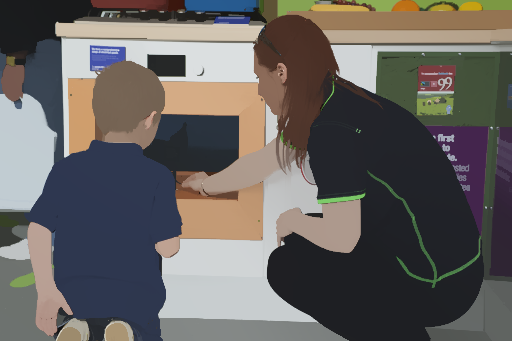
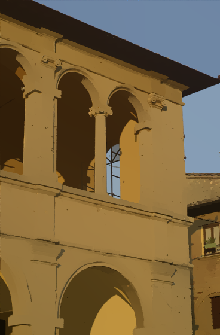

#L1 image flattening

original image | flattening
---

original image | flattening | edge-preserving smoothing
---
This is the code for our 2015 SIGGRAPH paper *An L1 Image Transform for Edge-Preserving Smoothing and Scene-Level Intrinsic Decomposition*. If you use this code, please cite our paper.

Please note that this implementation may not necessarily follow exactly what the paper describes. Given the size of energy function to be optimized, it may require 4 GB memory or more. In addition, to generate super-pixels, I have made use of an external program. For details, please see `demo.m`.

# Citation
	@article{L1Intrinsic,  
	    author = {Sai Bi and Xiaoguang Han and Yizhou Yu}, 
	    title = {An $L_1$ Image Transform for Edge-Preserving Smoothing and Scene-Level Intrinsic Decomposition}, 
	    journal = {ACM Trans. Graph. (Proc. SIGGRAPH)}, 
	    volume = {34}, 
	    number = {4}, 
	    year = {2015}, 
	    publisher = {ACM}, 
	}